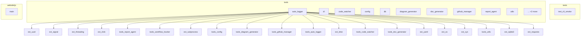

# portfolio - Architecture

*Generated on 2026-08-10*

```mermaid
graph TB
    subgraph tests["tests"]
        tests_0[test_cli_smoke]
    end
    subgraph tools["tools"]
        tools_0[auto_logger]
        tools_1[cli]
        tools_2[code_watcher]
        tools_3[config]
        tools_4[db]
        tools_5[diagram_generator]
        tools_6[doc_generator]
        tools_7[github_manager]
        tools_8[report_agent]
        tools_9[utils]
        tools_more["... +2 more"]
    end
    subgraph website\js["website\js"]
        website\js_0[main]
    end
    tools_0 --> ext_uuid
    tools_0 --> ext_signal
    tools_0 --> ext_threading
    tools_0 --> ext_click
    tools_0 --> tools_report_agent
    tools_0 --> tools_workflow_tracker
    tools_0 --> ext_subprocess
    tools_0 --> tools_config
    tools_0 --> tools_diagram_generator
    tools_0 --> tools_github_manager
    tools_0 --> tools_auto_logger
    tools_0 --> ext_time
    tools_0 --> tools_code_watcher
    tools_0 --> tools_doc_generator
    tools_0 --> ext_yaml
    tools_0 --> ext_os
    tools_0 --> ext_sys
    tools_0 --> tools_utils
    tools_0 --> ext_sqlite3
    tools_0 --> ext_requests
```