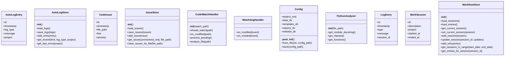

# portfolio - Class Diagram

*Generated on 2026-08-10*

```mermaid
classDiagram
    class AutoLogEntry {
        +id
        +timestamp
        +log_type
        +message
        +project
    }
    class AutoLogStore {
        -__init__()
        +load_logs()
        +save_logs(logs)
        +add_entry(entry)
        +get_recent(limit, log_type, project)
        +get_last_error(project)
    }
    class CodeIssue {
        +id
        +timestamp
        +file_path
        +line
        +severity
    }
    class IssueStore {
        -__init__()
        +load_issues()
        +save_issues(issues)
        +add_issue(issue)
        +get_issues(unresolved_only, file_path)
        +clear_issues_for_file(file_path)
    }
    class CodeWatchHandler {
        -__init__(watch_path)
        +should_watch(path)
        +on_modified(path)
        +process_pending()
        +analyze_file(path)
    }
    class WatchdogHandler {
        +on_modified(event)
        +on_created(event)
    }
    class Config {
        +project_root
        +data_dir
        +templates_dir
        +reports_dir
        +website_dir
        -__post_init__()
        +from_file(cls, config_path)
        +save(config_path)
    }
    class PythonAnalyzer {
        -__init__(file_path)
        +get_module_docstring()
        +get_classes()
        +get_functions()
    }
    class LogEntry {
        +id
        +timestamp
        +type
        +message
        +session_id
    }
    class WorkSession {
        +id
        +description
        +project
        +started_at
        +ended_at
    }
    class WorkflowStore {
        -__init__()
        +load_sessions()
        +load_entries()
        +get_current_session()
        +set_current_session(session)
        +add_session(session)
        +update_session(session_id, updates)
        +add_entry(entry)
        +get_sessions_in_range(start_date, end_date)
        +get_entries_for_session(session_id)
    }
```